# File-Browser-GBA — GBA SD file browser

A **cartridge-native microSD file manager for the Game Boy Advance** — it runs
*on the GBA itself* (EZ-Flash Omega DE, EverDrive GBA X5) and browses, copies,
moves, renames, deletes (with a **recycle bin**), and hex-edits the files on your
flashcart's microSD card. No PC, no DS — just the handheld.

## Screenshots

<table>
  <tr>
    <td align="center">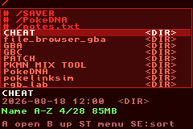<br><sub>Root of the card: pinned rows (<code>#</code>) stay on top, then the folders.</sub></td>
    <td align="center">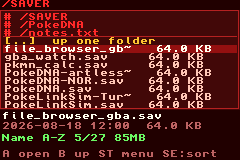<br><sub>A folder listing: names and sizes, the selected row's date below.</sub></td>
  </tr>
  <tr>
    <td align="center">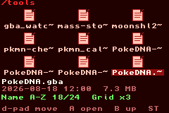<br><sub>Grid view inside <code>/tools</code>.</sub></td>
    <td align="center">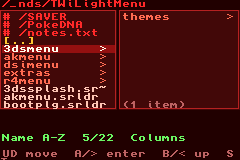<br><sub>Column view: the highlighted folder's contents in the right pane.</sub></td>
  </tr>
  <tr>
    <td align="center">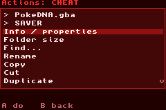<br><sub>START menu: the two shortcut rows (<code>&gt;</code>) sit above the actions.</sub></td>
    <td align="center">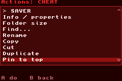<br><sub>The same menu on a folder: <em>Pin to top</em>.</sub></td>
  </tr>
  <tr>
    <td align="center">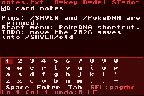<br><sub>Built-in text editor with the on-screen keyboard up.</sub></td>
    <td align="center">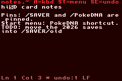<br><sub>After typing: the <code>*</code> in the status line marks the buffer as modified.</sub></td>
  </tr>
  <tr>
    <td align="center">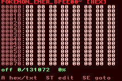<br><sub>Hex viewer on a 128 KiB save file (the demo bodies are all zeros).</sub></td>
    <td align="center">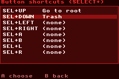<br><sub>Settings, Button shortcuts: SELECT+key slots with two bindings.</sub></td>
  </tr>
  <tr>
    <td align="center">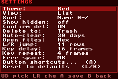<br><sub>Settings screen.</sub></td>
    <td align="center">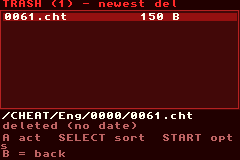<br><sub>Trash view after moving one <code>.cht</code> cheat file to the recycle bin.</sub></td>
  </tr>
  <tr>
    <td align="center">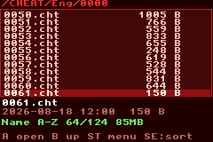<br><sub>A 124-file folder, mid-scroll after a few L/R jumps.</sub></td>
    <td></td>
  </tr>
</table>

Screenshots come from the virtual-SD harness under mGBA (`make vsd`, `tools/vsd_shots.py`); the card layout mirrors a real EZ-Flash Omega DE card (file names only, zero-filled bodies). v1.1 features are NOT hardware-tested yet — see HARDWARE-SIGNOFF.md.

## Status

**v1.0 — stable.** Feature-complete and fully hardware-validated, including the
reworked Trash view (sort cycle / origin-path rows / restore / days-left countdown).

**Hardware-validated.** The whole tool — browsing and every write feature
(new file/folder, rename/move, copy/cut/paste, duplicate, delete + the **recycle
bin**, attributes, the verified hex editor, settings, reboot-to-loader) — was
developed and tested directly on a **Game Boy Advance SP with an EZ-Flash Omega
DE**, and it works. There were **no emulator runs** — it ran on the cartridge
from the start. Builds clean (zero warnings).

> **Back up your microSD before bulk deletes** — EZ-Flash writes don't retry.
> With the default *Delete mode = Trash* the recycle bin is your undo; a
> *permanent* delete has none.
>
> **The EverDrive GBA X5 runs as a read-only browser, by design** — its write path
> isn't wired, so on the EverDrive you can browse / view / search but not create,
> move, rename, or delete. Every write feature is **EZ-Flash-Omega-only**.

**Phase 0 (read-only browser)** — runs on **both** carts; validated on real hardware:

- Directory listing with the `[..]` up-entry, folders sorted before files
- Navigation: UP/DOWN (auto-repeat), LEFT/RIGHT jump to top/bottom, L/R page up/down
- Sort by **Name / Size / Date** (SELECT cycles all 6 states) ascending/descending
- **Free / total space** on the status bar, plus a `sel/total` scroll-position indicator
- A **detail panel** under the list showing the highlighted entry's fuller name and its
  **date / time + size** (the complete name lives in Properties)
- File-type rows, and a read-only **file viewer** (Hex / Text, page-windowed so it
  handles files larger than RAM) via the actions menu's **View** item

**Phase 1 (write — EZ-Flash Omega only)** — validated on real hardware. Reached via the
actions menu (press **A** on a file, or **START** on a folder; write items appear
only on the Omega; the EverDrive stays read-only):

- An **on-screen keyboard** (QWERTY d-pad grid, both cases shown) for typed names,
  with FAT-name validation
- **New folder** (`f_mkdir`), **Delete** file or folder (recursive, with a confirm
  prompt; clears read-only as needed), and **attribute toggles** (read-only / hidden)
- **Properties** screen showing the **full name (wrapped)**, type, size, modified
  date/time, and attributes

**Phase 2 (Omega-only)** — via the actions menu:
- **Rename / move** (`f_rename`), keyboard pre-filled with the current name
- **Copy / Cut / Paste** with a clipboard: Copy or Cut an entry, navigate to a
  destination folder, then **Paste here**. Files and **whole folders** copy
  recursively; Cut is a same-volume move. Pasting onto an existing item asks to
  overwrite; pasting a folder into its own subtree is refused. A footer
  indicator shows what's on the clipboard (`[COPY]`/`[CUT]`).

- **Multi-select + batch** — from the actions menu, "Select multiple" enters a
  selection mode: **A** marks/unmarks the highlighted entry (shown with a `*`),
  **SELECT** marks all / clears all, the status bar shows the marked count + total
  size, and **START** opens a batch menu to **Copy / Cut / Delete** all marked
  items at once (and **Swap names** when exactly two are marked). **B** leaves
  selection mode. (Copy/Cut feed the same clipboard, so you then navigate and Paste.)

This completes the core file-manager feature set. Every write is confirmed and
logged to `/file_browser_gba/log.txt`.

**Phase 3 (Omega-only)** — an in-place **hex editor**. From the hex
viewer, **START** enters EDIT mode: a white-box cursor marks the editable byte,
**L/R** change its value, edited bytes show highlighted. **START** saves,
**SELECT** undoes pending edits, **B** exits. Saving is deliberately *not* an
in-place poke: it writes a temp copy with the edits applied, **byte-verifies** it
against original-with-edits, backs the original up to `<name>.bak~`, then
atomically renames the temp into place — so a failed write never corrupts the
file. File size is preserved (no insert/append). Validated on hardware (Omega DE).

### On-screen keyboard — editing mid-text

The keyboard has a **movable caret**: **L / R** move it through the text (the
editable cell is shown as a white box with black text), so you can fix a mistake
in the middle without deleting everything. **A** inserts at the caret, **B**
backspaces before it.

**Phase 4 (settings, themes, reboot)** — quality-of-life, reached from the actions
menu (always present on **both** carts):

- **Settings menu** with persistent preferences saved to `/file_browser_gba/settings.cfg`
  (the pre-1.1 root `/file_browser_gba.cfg` is still read if the new file is absent)
  (written on the Omega only; read on both carts — on the EverDrive settings are
  session-only and reset to defaults next launch). UP/DOWN pick a row, LEFT/RIGHT
  change the value (numeric rows auto-repeat on hold), **A** saves, **B** cancels
  and reverts. The settings: **theme**, **view** (List or **Grid x3–x6**),
  **sort** (key + direction),
  **show hidden** files, **confirm before delete**, **delete mode**
  (Trash / Permanent — see the recycle bin below), **auto-clear** (auto-delete
  trash older than N days, or Off), **default file viewer**
  (Hex/Text), **L/R jump distance**, **key-repeat delay**, **key-repeat speed**,
  **free-space unit** (B/KB/MB/GB), and **Reset to defaults** (L/R on that row;
  keeps the remembered folder).
- **10 themes** — Dark Blue (default), Dark Gray, Dark Green, Dark Purple, a Light
  high-contrast scheme, and 5 vivid schemes: **Pink, Red, Orange, Orange-Black,
  Blue-Black**. The theme previews live as you cycle it.
- **Three view modes** (pick from **Settings → View**, persisted):
  - **List** — the detailed one-per-row default.
  - **Grid / icon view** — theme-colored folder/file glyphs at a density you choose
    (**3–6 columns**). The d-pad moves in 2D (LEFT/RIGHT wrap to prev/next item,
    UP/DOWN jump a row, L/R page); the selected tile's full name + date/size show
    on the status line.
  - **Column (Miller) view** — a macOS-Finder-style two-pane cascade: the left pane
    is the focused folder, the right pane **previews the highlighted entry** — a
    folder's contents, or a file's info. **RIGHT / A** descends into the highlighted
    folder, **LEFT / B** goes back up, and the header shows the path breadcrumb.
- **Remembers the last folder** — reopens it on next launch (falls back to root
  if it no longer exists).
- **Reboot to loader** — soft-reboot back to the cart's loader menu (EZ-Flash
  kernel) instead of power-cycling. **Confirmed working on the EZ-Flash Omega
  DE.** Writes no data. (The EverDrive path is less tested.)

**Editing, pins and shortcuts (v1.1 candidate, Omega-only writes)**:

- **Text editor** - *Edit text* in the actions menu opens files up to 32 KiB with an
  on-screen keyboard, undo, CRLF/LF preservation and a verified save that keeps the
  original as `<file>.bak~`.
- **Pin to top** - pinned files/folders appear first in every folder (List / Grid /
  Columns); A jumps to the target.
- **START-menu shortcuts** - saved paths shown as the first rows of the START menu.
- **Button combos** - hold SELECT and press UP/DOWN/LEFT/RIGHT/A/B/L/R to jump to a
  bound path or run a bound action. Release SELECT alone to cycle the sort order.
- All of the tool's files live in `/file_browser_gba/` on the card
  (`settings.cfg`, `log.txt`, `pins.txt`, `shortcuts.txt`, `buttons.txt`).

**Recycle bin / Trash (Phase 7, Omega-only)** — `Delete` doesn't have to erase:

- **Move to Trash** — with **Delete mode = Trash** (the default), deleting a file
  or folder **moves** it into a hidden `/.sdtrash` recycle bin instead of erasing
  it. The move is a same-volume rename — *atomic, instant, and zero-copy* even for
  a huge folder — so nothing is duplicated and nothing is at risk. Each trashed
  item records where it came from in a tiny sidecar, so it can be put back. (Set
  **Delete mode = Permanent** in Settings to erase directly, the old behaviour.)
- **Restore** — open **Trash (recycle bin)…** from the actions menu, pick an item,
  and press **A → Restore** to move it back to its original folder. If that folder
  is gone, it lands at the card root; if a file with the same name now exists,
  the restore is auto-renamed `name (restored).ext` so it **never overwrites**.
- **Delete forever / Empty Trash** — **A** on an item opens its menu (**Restore**
  or **Delete forever**); **START** opens trash options including **Empty Trash**.
  These are the only steps that actually erase data, and each asks to confirm.
- **Sort, paths & countdown** — **SELECT** cycles how the bin is sorted:
  *newest deleted*, *oldest deleted*, *name A-Z/Z-A*, and *origin-path A-Z/Z-A*.
  From **START → options** you can switch the rows to show each item's **original
  path** instead of its name (so you can scroll through where things came from).
  When **Auto-clear** is on, every row and the detail line show a **"Nd"
  countdown** — the days left before that item is auto-deleted.
- The recycle bin folder is internal — it's hidden from normal browsing (even
  with *Show hidden* on) and reached only through the Trash action, so you can't
  accidentally file things into it. Batch delete (multi-select) honours the same
  Trash/Permanent mode.
- **Auto-clear old trash** — a Settings option (**Auto-clear**, *Off* by default,
  1–365 days) automatically deletes trashed items older than the chosen number of
  days, checked once at launch. Age is measured from when the item was trashed
  (the cart RTC). It is purely opt-in and *fails safe*: if the setting is Off or
  the RTC isn't readable, nothing is ever auto-deleted.

**More file operations** — added to the actions / batch / viewer:

- **Find…** — recursive keyword search from the current folder: type a keyword and
  get a scrollable list of every file/folder whose name contains it (ASCII
  case-insensitive). Picking a result drops you in that item's folder with it
  highlighted. Read-only, works on **both** carts. (Search everything by going to
  `/` first.)
- **Folder size** — recursively totals a folder's bytes + file/subfolder counts
  (read-only, works on **both** carts).
- **Duplicate** — copies the selected file/folder in place under an auto-suffixed
  name (`foo.txt` → `foo (copy).txt`); folders duplicate recursively. *(Omega)*
- **New file** — creates an empty file via the keyboard (then fill it with the
  hex editor). *(Omega)*
- **Swap names** — in selection mode, mark **exactly two** items and pick "Swap
  names" to exchange their filenames (a safe 3-way rename). *(Omega)*
- **Go to offset** — in the file viewer, jump straight to a hex byte offset
  instead of paging there.

The actions menu now **scrolls** (▲/▼ indicators) when it holds more items than
fit on screen, so nothing spills past the box.

**File-type viewers (Phase 6)** — the actions menu routes a file to a viewer by
its extension, with **View (hex/text)** always available as the fallback:

- **Open by type** — a small extension→viewer registry. A recognized type adds an
  "Open" row above "View"; everything else just uses the hex/text viewer.
- **Image viewer (BMP)** — "View image" on a `.bmp` decodes it to the screen,
  integer-downscaled to fit 240×160 (uncompressed 8/16/24/32-bit). Read-only,
  both carts. **B** returns.
- **Word-wrapped text** — the text viewer now wraps at word boundaries, expands
  tabs, skips CR, and handles line breaks (the font is ASCII; high bytes show as
  `.`).

> **Honest scope:** real **MP3/AAC playback, MP4/H.264 video, and PDF rendering
> are not feasible** on the GBA's 16.78 MHz CPU (+ the OS-mode SD constraint).
> Planned instead: *metadata/info* views (ID3 tags, MP4 codec/resolution, PDF page
> count) and more image formats (PNG/GIF/JPEG). We never pretend to play/render
> what the hardware can't.

## Controls

| Key | Action |
|-----|--------|
| UP / DOWN | Move cursor (hold to repeat) |
| LEFT / RIGHT | Jump up / down by the configured distance (default 11 rows) |
| L / R | Page up / page down (one screen) |
| A | **Folder:** open it · **File:** open the **actions menu** (a type-specific **Open** e.g. *View image* for `.bmp` / **View** hex-text / Info / **Find…**; **Settings…** and **Reboot to loader…** always; and on Omega: rename / copy / cut / duplicate / paste here / attributes / **delete (→ Trash)** / **Trash (recycle bin)…** / new file / new folder / select multiple) |
| START | **Any item:** open the **actions menu** (the same menu A opens on a file — **View** lives inside it; this is also how you reach Settings/Reboot/Find when nothing is selected) |
| B | Up one folder |
| SELECT | Cycle the sort: 6 states across Name / Size / Date, each ascending and descending. The status bar spells out the active one — "Name A-Z", "Name Z-A", "Size small-big", "Size big-small", "Date old-new", "Date new-old". Folders always sort before files. |

> **Note:** START opens the actions menu on any item; on a file that's the same
> menu as A (which holds **View**). SELECT cycles the sort. START stays the
> consistent primary/confirm button in the keyboard, hex-editor save, and settings.

### Selection mode (from "Select multiple")

| Key | Action |
|-----|--------|
| A | Mark / unmark the highlighted entry (`*`) |
| SELECT | Mark all / clear all |
| START | Batch menu: Copy / Cut / **Trash or Delete** (per delete mode) (and **Swap names** when exactly 2 are marked) |
| B | Leave selection mode |

### Trash view (from "Trash (recycle bin)…", Omega)

| Key | Action |
|-----|--------|
| UP / DOWN | Move through trashed items (hold to repeat); L / R page |
| A | Item menu: **A = Restore** to its original folder · **START = Delete forever** (confirm) |
| SELECT | Cycle sort: newest/oldest deleted · name A-Z/Z-A · origin-path A-Z/Z-A |
| START | Options: rows show **name** or **origin path** · **Empty Trash** (confirm) |
| (rows show **"Nd"** = days left before auto-clear deletes them, when Auto-clear is on) ||
| B | Back to the browser |

### Settings menu

| Key | Action |
|-----|--------|
| UP / DOWN | Pick a setting |
| LEFT / RIGHT | Change the highlighted value (numeric rows auto-repeat on hold; theme/sort/toggles step once per press) |
| A / START | Save and close |
| B | Cancel — revert every change, including the live theme preview |

### Find results

| Key | Action |
|-----|--------|
| UP / DOWN | Move through the matches (hold to repeat) |
| A / START | Go to the highlighted match (opens its folder with it selected) |
| B | Back to the browser |

### On-screen keyboard (QWERTY)

| Key | Action |
|-----|--------|
| d-pad | Move the character cursor (hold to repeat); rows: numbers, qwerty, lower, upper, symbols + space |
| L / R | Move the text caret left / right (hold to repeat; edit mid-text, caret shown as a white box) |
| A | Insert the highlighted character at the caret |
| B | Backspace (delete before the caret) |
| START | Confirm |
| SELECT | Cancel |

### In the file viewer

| Key | Action |
|-----|--------|
| A | Toggle Hex ↔ Text |
| UP / DOWN | Scroll one row |
| L / R | Page up / page down |
| LEFT / RIGHT | Jump to start / end of file |
| SELECT | Go to offset (type a hex offset) |
| START | (hex, Omega) enter EDIT mode |
| B | Back to the browser |

### Hex editor (EDIT mode)

| Key | Action |
|-----|--------|
| d-pad | Move the byte cursor (white box); auto-scrolls |
| L / R | Decrease / increase the cursor byte (hold to repeat) |
| START | Save (confirm; original kept as `<name>.bak~`) |
| SELECT | Undo all pending edits |
| B | Leave EDIT mode (prompts if there are unsaved edits) |

## Build

Requires only Docker (no local toolchain):

```sh
./build.sh
```

Or, with a local devkitPro `gba-dev` environment, from this directory:

```sh
make rebuild
```

Output: `file_browser_gba.gba` (ROM title `FILEBRWSGBA`). Copy it to the flashcart's SD
card and launch it like any other GBA ROM.

This repository is **self-contained**: the shared hardware/filesystem layer
(flashcartio, FatFs, the EZ-Flash Omega + EverDrive block drivers, the cartridge
RTC and the logger) is vendored into `lib/` and `source/`, so `build.sh` only
mounts this folder and `make` finds everything locally — no external checkout.

## Development: the virtual SD card

`make vsd` builds a private `file_browser_gba-vsd.gba` in which the flashcart SD driver is
replaced by a mailbox that a host script serves from a FAT16 image while the ROM runs in
mGBA (the seam and the protocol are documented in the gba-toolkit's
`docs/kb/virtual-sd-harness.md`). The shipped ROM (`make`) contains none of it: the seam is
compiled out, so the `vsd_*` symbols are absent and every other object file is byte-identical
(`tools/vsd_chains.py` chain 12 checks that).

```sh
make vsd                                  # needs the devkitARM environment, like make
sh tests/run_host.sh                      # host tests; also builds /tmp/vsd_img (tools/build_vsd_host.sh)
python3 tools/vsd_chains.py --all         # 12 fault-injection chains on fresh 32 MiB cards
python3 tools/vsd_chains.py --only 7      # one chain (7 = the fail_at / lie_after sweeps)
python3 tools/vsd_shots.py                # rebuilds docs/screenshots/*.png from the demo card
```

The chains drive the real UI by key taps and judge the card itself: which paths changed, the
exact bytes of the edited file, and the lines the app logged. They run under mGBA with the
Python bindings from `projects/rec2mp4/vendor` of the gba-toolkit (or set `VSD_MGBA_VENDOR`).
The harness cannot prove the EZ-Flash OS-mode timing, the real card's behaviour or anything
that needs the physical cartridge; those stay in HARDWARE-SIGNOFF.md.

## Layout

```
File-Browser-GBA/
  Makefile          # devkitARM/libtonc build; auto-globs source/ + lib/
  build.sh          # Docker build (mounts this folder; no toolchain needed)
  LICENSE           # GPLv3 (this project)
  LICENSE.*         # upstream dependency licenses (see Credits)
  source/
    main.c          # bring-up + browser UI/state machine; actions/settings/reboot/trash
    fs_ops.c/.h     # pure-C file ops: list / sort / free-space / copy / delete (host-testable)
    osk.c/.h        # on-screen QWERTY keyboard with a movable caret
    ui.c/.h         # Mode-3 bitmap UI layer
    theme.c/.h      # 5 runtime color themes; UI_* macros read the active theme
    cfg.c/.h        # /file_browser_gba/settings.cfg INI settings (load both carts, save Omega-only)
    gba_rtc.c/.h    # cartridge RTC read (file timestamps)         [vendored shared]
    log.c/.h        # screen + mGBA + SD triple logger              [vendored shared]
  lib/
    flashcartio*.*  # cart detect + SD sector I/O (Omega DE / EverDrive X5)
    sys.h
    fatfs/          # ChaN's FatFs (ff.c, diskio, ffconf, …)
    ezflashomega/   # io_ezfo block driver
    everdrivegbax5/ # EverDrive block driver
```

## Design rules (inherited from the gba-toolkit family)

- **Never corrupt user data.** Every mutating op upholds "never leave the user
  with neither the old file nor a complete new one": overwrite + hex-save use a
  verified swap (write temp → byte-compare → `.bak~` backup → atomic rename);
  delete-to-Trash and Restore are atomic same-volume moves; EZ-Flash writes have
  **no retry**, so they are always verified.
- **Write is EZ-Flash-Omega-only** (the EverDrive write path is not wired): all
  write features gate on `active_flashcart == EZ_FLASH_OMEGA`; the EverDrive runs
  as a read-only browser.
- **OS-mode rule:** the game ROM is unmapped during any SD transfer — the code
  never renders mid-transfer (FatFs handles its own transfers).
- **No big buffers on the 32 KiB IWRAM stack:** large/static buffers live in
  `EWRAM_BSS`/`.sbss`.
- **Pure-C core:** `fs_ops.c` avoids tonc/GBA headers so the list/sort/copy logic
  can be host-compiled.

**Anything touching the SD write path, the RTC, or user data is not "done" until
real-hardware sign-off** — the SD path is not emulated. That sign-off is **done**:
the whole tool, including the recycle bin, was developed and tested on a GBA SP +
EZ-Flash Omega DE. See [HARDWARE-SIGNOFF.md](HARDWARE-SIGNOFF.md).

## License

**GPLv3** — see [LICENSE](LICENSE). Always free and open-source; you may use,
study, modify and redistribute it, but derivatives must stay GPL (no closed-source
or proprietary forks).

## Credits

Built on devkitARM + [libtonc](https://github.com/devkitPro/libtonc), and on this
open-source work — their licenses are included and respected:

- **FatFs** by ChaN — the FAT/exFAT filesystem (BSD-style license, see
  `lib/fatfs/00readme.txt`).
- **gba-flashcartio** by Rodrigo Alfonso (afska) — flashcart SD I/O for the
  EZ-Flash Omega/DE and EverDrive GBA X5 — MIT, see
  [LICENSE.gba-flashcartio](LICENSE.gba-flashcartio).
- **EZ-Flash Omega `disc_io`** lineage — Apache-2.0, see
  [LICENSE.ezfo-disc_io](LICENSE.ezfo-disc_io).

## Disclaimer

This is unofficial homebrew. It is **not affiliated with, endorsed by, or
sponsored by** Nintendo, EZ-Flash, or Krikzz/EverDrive. "Game Boy Advance",
"EZ-Flash", and "EverDrive" are trademarks of their respective owners, used here
only to describe compatibility. The project **ships no copyrighted content** —
bring your own files. Use it at your own risk and back up your microSD card.

## Prior art

A search of GitHub, GBAtemp and the wider homebrew scene found **no
general-purpose, cartridge-resident GBA file manager** in open source — the
closest is the read-only `gba-flashcartio` demo, the Supercard firmware menus
(SuperFW / SCFW), and the old "GBA Filer" homebrew. Everything else that browses
files (GodMode9i, TWiLightMenu, FlashGBX, …) runs on the DS/3DS or a PC, not on
the GBA itself. **File-Browser-GBA** fills that gap: a polished file manager that
runs on the Game Boy Advance.
